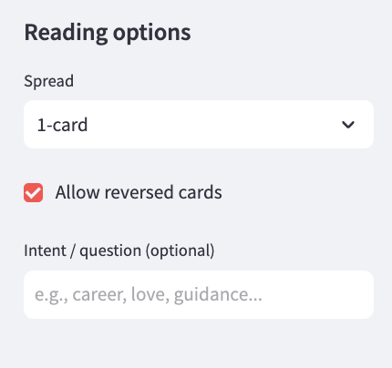
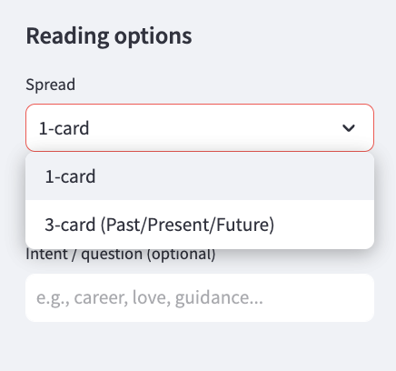
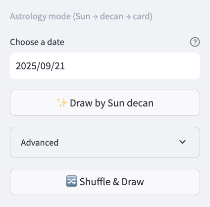
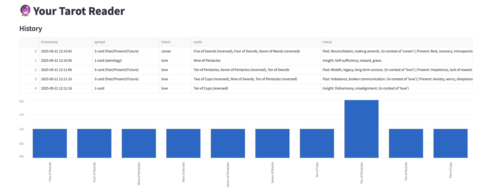

# 🔮 Your Tarot Reader


A Streamlit app for tarot readings with two modes:

- **Shuffle & Draw** — 1-card or 3-card (Past/Present/Future); optional reversed cards.
- **Astrology mode** — pick a date; the app maps the Sun sign + decan to one of the 36 pip cards (2–10). Rule-based and deterministic.

The repo includes unit tests (pytest), GitHub Actions CI, and a Dockerfile.

---

## Quickstart

### Run locally
```bash
pip install -r requirements.txt
streamlit run app.py
# open http://localhost:8501
```

### Run tests
```bash
pytest -q
```

## Docker

### Run
```bash
docker run -p 8501:8501 vkrst/your-tarot-reader:latest
# then open http://localhost:8501
```
### Save history to a local file (optional)
```bash
docker run -p 8501:8501 \
  -v "$(pwd)/readings.csv:/app/readings.csv" \
  vkrst/your-tarot-reader:latest
```
### Build locally instead of pulling (optional)
```bash
docker build -t your-tarot-reader .
docker run -p 8501:8501 your-tarot-reader
```
---

## Features

- 1-card and 3-card spreads; reversed cards supported.
- **Reproducibility controls**: daily seed, custom seed, or fully random.
- **Astrology mode**: date → Sun sign & decan → mapped pip card (deterministic).
- Save readings to `readings.csv`; simple bar chart of most-drawn cards.
- Tests for deck schema, draw determinism, interpretation, astrology mapping, and storage.
- CI on push/PR; containerized with Docker.

---

## Results

### App tour

| Sidebar options | Shuffle & Draw | Astrology mode |
|---|---|---|
|  |  |  |

**What you’re seeing**
- **Sidebar options:** Pick **1-card** or **3-card (Past/Present/Future)**, allow **reversed** cards, and add an **intent** (e.g., “career”). Under **Advanced**, choose randomness: **Daily seed** (same draw per date), **Seeded**, or **No seed**.
- **Shuffle & Draw:** Example reading with card titles, arcana/suit line, keywords, and contextualized meanings (the 3-card spread labels your positions as Past, Present, Future).
- **Astrology mode:** Choose a date; the app maps the **Sun sign + decan** to one pip card (2–10). It’s rule-based and deterministic, so the same date always yields the same card.

### History & quick analytics

<p align="center">
  
</p>

- Clicking **“Save to history”** appends a row to `readings.csv` with timestamp, spread, intent, seed, the drawn cards, and interpretations.
- The bar chart aggregates card names across saved readings to show which appear most often.
- Because seeds/dates are recorded, you can reproduce results later (handy for demos and testing).


---

## Data

- `data/deck.csv` (CSV with columns: `name, arcana, suit, keywords, upright, reversed`).
- Astrology mode uses a standard mapping from zodiac **decans** to the 36 pip cards (2–10 across suits).

---

## Reproducibility

- Pinned dependencies in `requirements.txt`.
- Deterministic draws when a seed is set (daily or custom).
- Unit tests runnable via `pytest` and enforced by CI.

---

## Project structure

```
your-tarot-reader/
├─ app.py
├─ data/
│  └─ deck.csv
├─ tarot/
│  ├─ __init__.py
│  ├─ astro.py        # date → sign/decan → card
│  ├─ deck.py         # load_deck()
│  ├─ draw.py         # shuffle_and_draw()
│  ├─ interpret.py    # interpret_spread()
│  └─ storage.py      # save_reading(), load_history()
├─ tests/
│  ├─ test_astro.py
│  ├─ test_deck.py
│  ├─ test_draw.py
│  ├─ test_interpret.py
│  └─ test_storage.py
├─ .github/workflows/ci.yml
├─ Dockerfile
└─ requirements.txt
```

---

## Notes

- Astrology mode uses approximate tropical sign date ranges split into three ~10-day decans; it returns upright meanings.
- This project is for educational/entertainment use.
